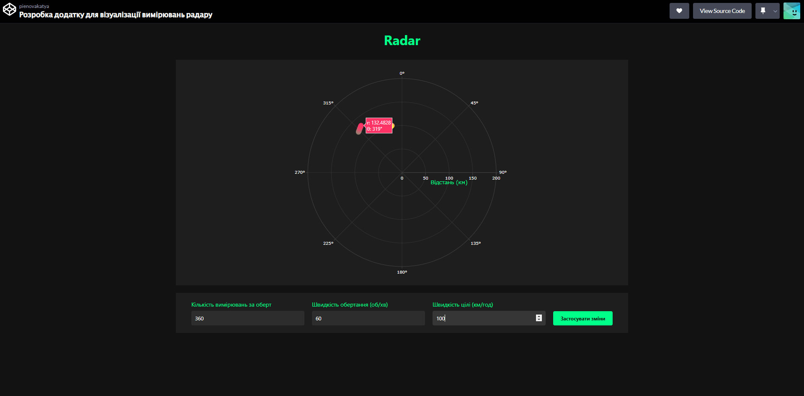
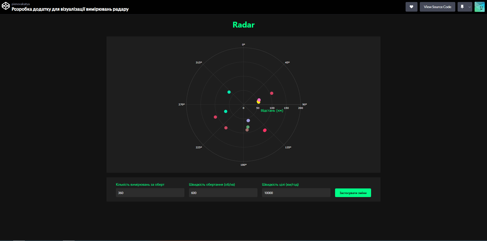
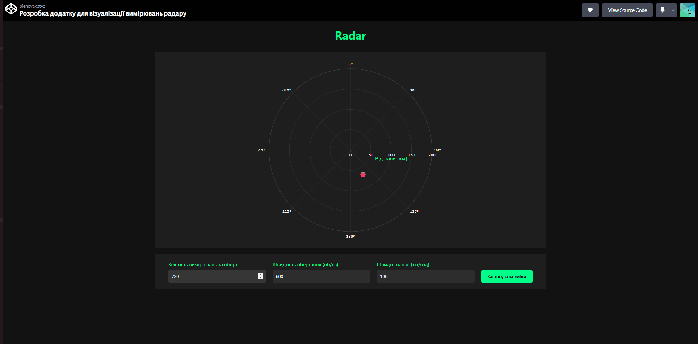

<h1 align="center">Звіт з лабораторної роботи №2</h1>
<h2 align="center">Розробка додатку для візуалізації вимірювань радару</h2>

 

## Мета роботи
Розробити веб-додаток для візуалізації даних радарного вимірювання в реальному часі з можливістю налаштування параметрів роботи радару через API.

## Завдання роботи
Створення веб-додатку, що підключається до емульованої вимірювальної частини радару через WebSocket, обробляє отримані дані та відображає задетектовані цілі на полярному графіку з можливістю налаштування параметрів вимірювань.

## Реалізація проєкту

### Основний інтерфейс
Розроблений веб-додаток представляє собою інтерактивний радарний дисплей з круговою координатною сіткою та елементами керування параметрами.

 

Головний інтерфейс програми з радарним дисплеєм та панеллю налаштувань

### Візуалізація цілей
При виявленні цілі система відображає її позицію та характеристики на радарному дисплеї з відповідними координатами та рівнем сигналу.

 

Відображення виявленої цілі з координатами та параметрами сигналу

### Налаштування параметрів сканування
Система дозволяє змінювати основні параметри роботи радару:
- Кількість вимірювань за оберт (від 360 до 720)
- Швидкість обертання антени (від 60 до 600 об/хв)
- Швидкість руху цілей (від 100 до 10000 км/год)

 

Демонстрація роботи системи з підвищеною швидкістю сканування, що дозволяє виявляти більше цілей

### Оптимізація параметрів
При збільшенні кількості вимірювань та швидкості обертання покращується деталізація сканування, але збільшується навантаження на систему.

 

Режим роботи з оптимізованими параметрами для балансу між швидкістю та точністю сканування

## Результати роботи

В ході виконання лабораторної роботи було успішно реалізовано:
- Підключення до емулятора радару через WebSocket
- Візуалізацію даних на полярному графіку в реальному часі
- Інтерфейс налаштування параметрів через API
- Оптимізацію продуктивності для різних режимів роботи

## Висновок
Розроблений додаток успішно виконує поставлені завдання з візуалізації радарних даних та надає зручний інтерфейс для налаштування параметрів роботи. Тестування показало, що система здатна ефективно працювати з різними конфігураціями параметрів, забезпечуючи необхідний баланс між швидкістю оновлення даних та точністю визначення цілей.
